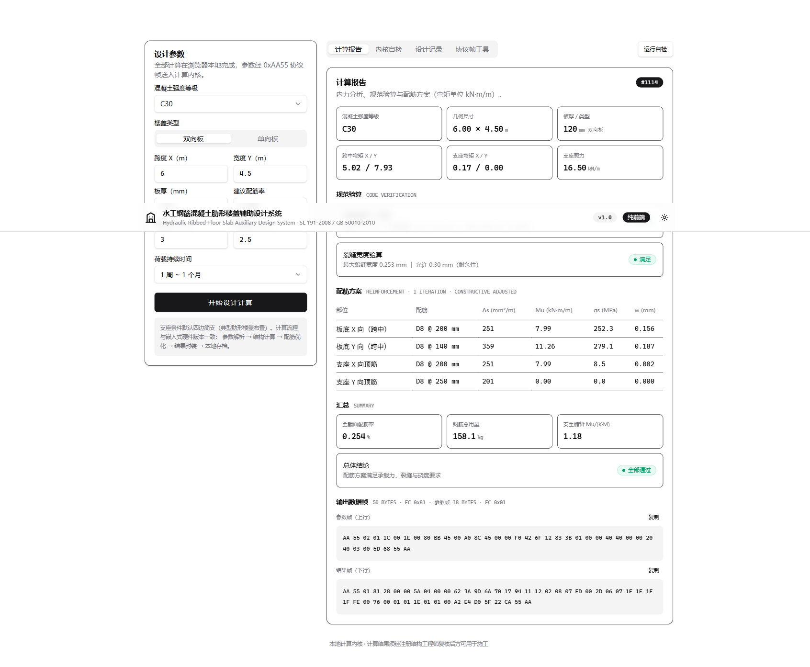
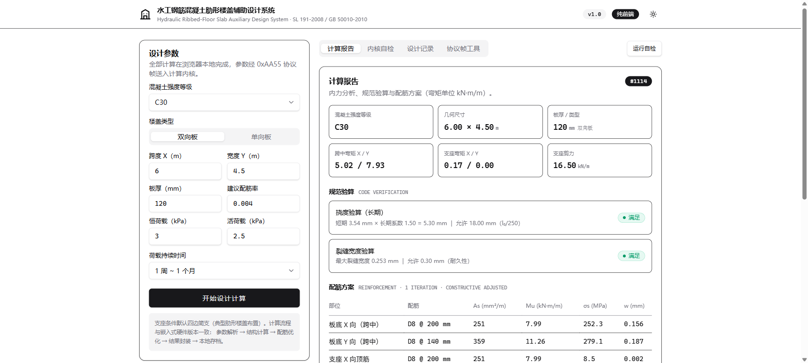

<div align="center">

# 肋形楼盖辅助设计系统 · 纯前端版

**水工钢筋混凝土肋形楼盖辅助设计系统的纯浏览器实现** —— 计算内核由 C++ 完整移植为
TypeScript，无需服务器、无需安装，打开网页即可完成 FEM 内力分析、规范验算与配筋优化。

[](https://edgeone.ai/deploy?repo=https://github.com/iCxin/ribbed-floor-web)
[](https://react.dev)
[](https://vite.dev)
[](https://www.typescriptlang.org)
[](https://tailwindcss.com)
[](#内核自检)

</div>

---

与[嵌入式 / 桌面版（C++）](https://github.com/iCxin/ribbed-floor-design-system)共用同一套算法与
二进制协议：参数经 0xAA55 协议帧（CRC16）送入流水线，依次完成
**参数解析 → ACM 板弯单元 FEM → 规范配筋优化 → 结果帧封装 → 本地存档**，
计算依据 SL 191-2008 / GB 50010-2010。

> ⚠️ 输出为辅助计算结果，用于实际工程设计前须经注册结构工程师复核。

## 截图

| 计算报告 | 内核自检（17/17） |
| --- | --- |
|  |  |

## 功能

- **设计计算** —— 强度等级 C20~C80、单向/双向板、几何与荷载参数 → 完整设计报告
  （弯矩包络、挠度/裂缝验算、四部位配筋方案、用钢量、上下行协议帧十六进制）
- **内核自检** —— 页面内置 17 项断言：CRC16/CRC32/MD5 黄金向量、帧协议自反性、
  FEM 与 Timoshenko 简支板解析解对比、承载力公式往返、端到端流水线
- **设计记录** —— localStorage 存档（最近 50 条循环覆盖），可一键载入重算
- **协议帧工具** —— 粘贴十六进制参数帧直接走解析流水线（与硬件接口等价路径）
- **亮 / 暗双主题** —— shadcn/ui 风格（zinc 色板），跟随系统并持久化

## 一键部署（腾讯云 EdgeOne Pages）

点击上方 **Deploy to EdgeOne** 徽章，或手动操作：

1. 登录 [EdgeOne Pages 控制台](https://console.cloud.tencent.com/edgeone/pages)，
   选择 **创建项目 → 从 Git 仓库导入**，授权并选择本仓库；
2. 框架预设选择 **Vite**（仓库内 `edgeone.json` 已声明构建设置，通常自动填充）：

   | 配置项 | 值 |
   | --- | --- |
   | 安装命令 | `npm install` |
   | 构建命令 | `npm run build` |
   | 输出目录 | `dist` |
   | Node 版本 | 22 |

3. 点击 **立即创建**，约 1 分钟后获得 `*.edgeone.app` 域名，后续 push 自动触发重新部署。

本地开发：

```bash
npm install
npm run dev       # http://localhost:5173
npm run build     # 产物输出至 dist/
npm run preview
```

## 计算内核（src/kernel）

| 文件 | 内容 | 对应 C++ 版 |
| --- | --- | --- |
| `protocol.ts` | CRC16-XMODEM / CRC32、组帧解帧、参数/结果载荷编解码（含 4bit 直径编码、定点数） | `protocol.cpp` `result_pack.cpp` |
| `fem.ts` | ACM 四节点薄板弯单元：12 项多项式基形函数数值求逆、2×2 高斯积分、Cholesky 求解、内力包络 | `struct_calc.cpp` |
| `concrete.ts` | 材料库（C20~C80）、钢筋规格（D8~D25）、σs/裂缝宽度/抗弯承载力公式 | `struct_calc.cpp` `rebar_optim.cpp` |
| `optimizer.ts` | 约束优化：K≥1.2 承载力 + 裂缝 ≤0.3mm + 最小配筋率，规格匹配与回溯保护 | `rebar_optim.cpp` |
| `pipeline.ts` | 全流水线：参数校验 → 组帧 → 分析 → 优化 → 结果帧 | `system_controller.cpp` |
| `md5.ts` | RFC 1321 MD5（设计记录哈希索引） | `data_storage.cpp` |
| `selftest.ts` | 17 项内核自检 | `main.cpp --selftest` |
| `history.ts` | localStorage 设计记录（循环覆盖） | `data_storage.cpp` |

## License

[MIT](LICENSE)
